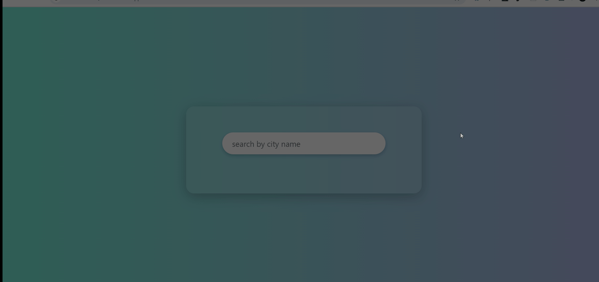

# ☁️ Weather App

A clean and simple weather app built with vanilla JavaScript, HTML, and CSS. It fetches real-time weather data using an API and displays location-based weather conditions.

---

## 🚀 Features

- 📍 Get weather by city name
- 🌡️ Shows temperature, humidity, wind speed
- 🖼️ Weather icons based on condition
- 📱 Fully responsive UI
- 🔁 Real-time data using OpenWeatherMap API
- 🚫 **City Not Found Handling** — User is shown a proper message if an invalid city is entered

---

## 🎥 Demo

---

## 🔧 Tech Stack

- HTML5
- CSS3
- JavaScript (Vanilla)
- OpenWeatherMap API

---

## 🧑‍💻 Developer

Developed by Asim Mir  
[GitHub: asim249](https://github.com/asim249)
